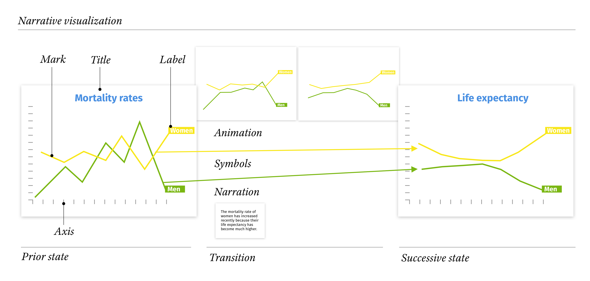

# Narrative visualization

## Explorative and explanative visualization

![Munzner[@munzner:14] uses the words "discover" for explorative and "present" for explanative visualization](./img/image-20190213162158465.png)

The focus of early visualization research has mostly been on *explorative visualization* as opposed to *explanative visualization*. Explorative visualization deals with three major constraints: *system resources* like memory and processing power, *display capacity* given for example by screen size and pixel density, and finally human *perceptual* and *cognitive* like preattentive mechanisms or working memory. Most of the research visualization is therefore concerned with maximizing information throughput regarding these limitations. [@munzner:14]

*Explorative* visualizations are targeted at researchers and help them *discover* new insights inside vast amounts of data. *Explanative* visualization, on the other hand, is used mainly for *presenting* information. [@munzner:14] The targeted audience are not specialists who will spend days, weeks or months with a given visualization, but a public who will only see it for a short amount of time. This leaves little room for learning the intricacies of a new idiom or to gain necessary topic knowledge necessary to correctly interpret complex visualizations. This new limitation has come to be known as "visualization literacy".[@Boy:2014],[@Lee:2017]

## Visualization literacy

Very little is known about how novices try to make sense of visualizations they are unfamiliar with. Lee et al. [@Lee:2015ij] show that most readers heavily rely on their topic knowledge to check if their ad-hoc interpretation of an unfamiliar visualization is correct.  When presenting unfamiliar material, it therefore often seems preferable to use well-known idioms like line charts or pie charts even if potentially more powerful idioms are available. Similar observations have been made regarding interactive visualizations in newspapers. [@Stabe:2016], [@Tse:2016] According to them, most readers don't take the time to explore complex and unfamiliar visualizations.

Exceptions exist, where very complex and creative visualizations seem to be liked by readers [@Lupi]. We hypothesize that these are probably due to a shift in the readers' goals. Instead of trying to understand the story, the readers now challenge themselves to understand the mechanics of the visualization. [@Manjoo:2013],  This would correspond to the third type of visualization, who are primarily *enjoyed* for their artistic appeal.[@munzner:14] 

Based on this observation, textbooks, and newspapers are typically rather conservative when using visualization, defaulting to well-known idioms. But recently, some authors have started to use storytelling techniques to progressively build topic knowledge and explain complex visualization idioms.[@Aisch:2017], [@Collins:2015], [@Anderson:2016vg] They have shown that teaching new visualization idioms by building on known ones can be successful [@Ruchikachorn:2015]

## Narrative visualization

This idea, of using storytelling techniques to introduce powerful visualization idioms to an audience with low visualization literacy, has led to the formation of a branch of research in *narrative visualization* [@Segel:2010uj], [@Hullman:2013], [@Satyanarayan:2014] Narrative visualization follows in many aspects the same principles as other, established means of storytelling. Multiple publications have explored the usage of these principles in the context of narrative visualization. Examples being videos [@Amini:2015], comics [@Bach:2016] or narrated sketching [@Lee:2013bq].

One particularity of narrative visualization is that it can be partially non-linear and explorative. Segel et al. [@Segel:2010uj] describe how exploration is integrated into the typically linear structure of storytelling. The *martini glass* structure starts with a sequence of states and leaves the reader to explore a visualization at the end. The *drill down*  structure starts with exploration until the reader chooses a topic and is led through a sub-story sequentially. Finally, the *interactive slideshow* is structured by an overarching sequence of states and integrates exploration at every step.

![The different structures of non-linear storytelling in narrative visualization described by Segel et al.[@Segel:2010uj]](./img/storytelling structure.png)

Even though exploration is often a part of narrative visualization, it always contains one or many author-defined sequences of states that contain the major insights the author wants to convey. This intent to communicate a set story puts narrative visualization into the explanative visualization category. Its quality is therefore measured by the readers understanding of the story.

The ordering of states is highly relevant to understanding a story and scrambling it will lead worse comprehensibility and recall of the information [@Thorndyke:1977dd] This observation should be discouraging for including explorative aspects in narrative visualization which by their nature introduce non-linearity. We think the problem lies with the definition of a state. Just as the story of a movie is not changed by showing more of the scenery in one shot, the story of a narrative visualization is not changed by letting the reader explore details of the current state. A similar view is held by Hullman et al. who define a state as an "informationally distinct visual representation" [@Hullman:2013]; a definition to which we will also adhere to in this work.

The observation about the importance of sequence also implies that there is some information inherent in the ordering of states that is not present in the states themselves. The transition between the two states, therefore, carries implicit information that is essential to the understanding of the story. Transitions then are a basic element of narrative visualization and we will go on to present some of their properties in greater detail.
